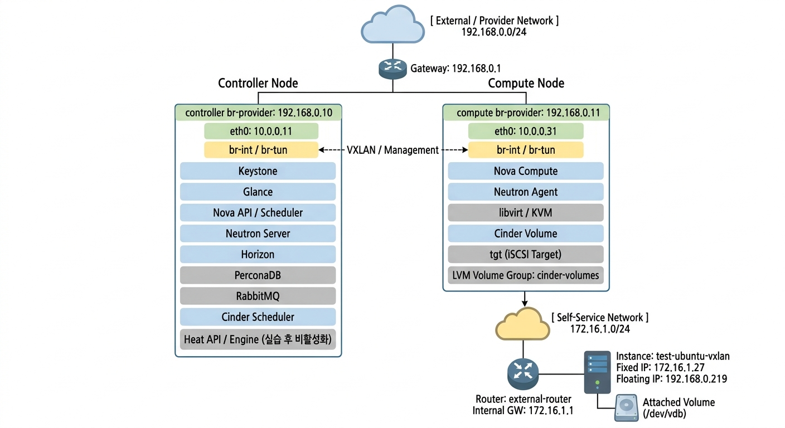
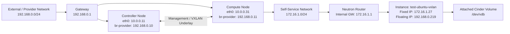

# ☁️ OpenStack 2-Node Manual Build Lab

Hyper-V 기반 Ubuntu 환경에서 OpenStack을 수동 구축하고,  
Neutron self-service 네트워크와 Cinder LVM 백엔드를 구성하여  
인스턴스 외부 접근 및 블록 스토리지 attach까지 검증한 2노드 실습 프로젝트입니다.

---

## 📌 Overview

이 프로젝트는 **controller + compute** 2노드 환경에서 OpenStack 주요 서비스를 직접 수동 구축하고,  
네트워크 및 스토리지 기능을 실제로 검증한 실습 내용을 정리한 것입니다.

단순 설치에 그치지 않고, 아래 항목까지 직접 확인했습니다.

- Neutron 네트워크 구조 변경
- provider direct attach 실패 원인 분석
- self-service + router + floating IP 구조 전환
- Cinder LVM backend 구성
- volume attach 및 guest 내부 mount 검증
- Heat 설치 및 기본 동작 확인

---

## 🧭 Architecture at a Glance

---

## 🖥️ Environment

- Virtualization: Hyper-V
- OS: Ubuntu-24.04.1
- Deployment Type: 2-node manual build lab
### Controller Node
- Keystone
- Glance
- Nova API
- Nova Scheduler
- Neutron Server
- Horizon
- PerconaDB
- RabbitMQ
- Cinder Scheduler
- Heat API / Heat Engine (tested, later disabled due to memory limits)
### Compute Node
- Nova Compute
- Neutron Agent
- libvirt / KVM
- Cinder Volume
- tgt (iSCSI target)
- LVM backend (cinder-volumes)

---

## 🌐 Network Design

### Physical / Host-side Networks
- Management network: `10.0.0.0/24`
- Provider network: `192.168.0.0/24`
### Tenant Network
- Self-service network: `172.16.1.0/24`
### Key Concepts
- **Provider network**: external network
- **Self-service network**: tenant internal network
- **Fixed IP**: instance internal IP
- **Floating IP**: external access IP
### Final Network Model
최종적으로 인스턴스는 **self-service 네트워크**에 연결되고,
**Neutron Router + Floating IP**를 통해 외부에서 접근하는 구조로 구성했습니다.

---

## 🧱 What I Built

### 1) OpenStack Core Services
- Keystone / Glance / Nova / Neutron / Cinder 구축
- Controller / Compute 2노드 기반 수동 구성
- 주요 서비스 정상 동작 확인

### 2) Networking
- self-service VXLAN 네트워크 구성
- router 연결
- floating IP를 통한 외부 접근 검증
- provider direct attach 실패 원인 분석 및 구조 변경

### 3) Storage
- compute 노드에 LVM 기반 Cinder backend 구성
- volume 생성
- instance attach
- guest 내부에서 /dev/vdb 인식
- filesystem 생성 및 mount 검증

### 4) Orchestration
- Heat 설치 및 template validate / stack create 확인
- 단, 실습 환경 메모리 한계로 상시 운영은 제외

---

## 🛠️ Key Troubleshooting
### 1️⃣ Provider Network Direct Attach Failure
초기에는 인스턴스를 provider network에 직접 연결했지만,
정상적으로 ping이 되지 않았습니다.

### Problem
- Neutron 포트 정보와 guest OS의 실제 IP가 일치하지 않음
- 인스턴스 통신 실패
### Cause
- 외부 LAN DHCP와 Neutron DHCP/주소 관리 충돌
### Resolution
- provider direct attach 방식 폐기
- self-service + router + floating IP 구조로 전환

### 2️⃣ Cinder Volume Attach Failure
볼륨 attach 과정에서 `Create export for volume failed` 오류가 발생했습니다.

### Cause
- `cinder-volumes` VG 미구성
- `/etc/tgt/conf.d/cinder.conf` 누락
- iSCSI export 생성 실패
### Resolution
- 보조 디스크 추가
- LVM 구성
- tgt 설정 추가
- `cinder-volume` / `tgt` 정상화

### 3️⃣ Heat / Controller Memory Pressure

Heat 설치 후 controller 메모리 부족으로 Percona/MySQL이 반복적으로 종료되는 문제가 발생했습니다.

### Cause
- 제한된 실습 자원에서 controller 서비스가 과도하게 적재됨
- OOM killer에 의해 mysqld 종료
### Action
- Heat 기본 동작은 확인
- 실습 마무리 단계에서는 상시 운영 대상에서 제외

---

## ✅ Verification
다음 항목을 실제로 검증했습니다.

- Instance creation
- Self-service networking
- Router connectivity
- Floating IP access
- Cinder volume creation
- Volume attach
- In-guest block device recognition
- Filesystem creation and mount
- Heat template validation / basic stack creation

### Screenshot
- Instance and Network

    
Horizon

        
        

 

- Neutron Network Structure

    
Horizon

        
        

 

- Volumue Attachment

    
Horizon

        

 

- Inside the Instance

---

## 📚 Lessons Learned
- provider network 직접 연결은 환경에 따라 DHCP 충돌 위험이 있다.
- OpenStack Neutron은 `network / subnet / router / floating IP` 구조로 이해해야 한다.
- fixed IP와 floating IP의 역할은 명확히 다르다.
- Cinder는 서비스 상태뿐 아니라 backend(LVM, iSCSI target)까지 함께 봐야 실제 동작 여부를 판단할 수 있다.
- 실습 환경에서는 기능 확장보다 안정적인 기본 구성 유지가 더 중요할 수 있다.

---

## ⚠️ Limitations
- 별도 storage node를 분리하지 않고 compute가 Cinder backend 역할을 겸함
- Heat는 메모리 제약으로 상시 운영하지 않음
- production 환경이 아닌 lab / learning 목적 구성

---

## 🔒 Notes

- 이 저장소는 학습 및 실습 목적의 공개용 정리본입니다.
- 민감 정보(비밀번호, 토큰, 내부 환경 정보 등)는 포함하지 않았으며,
- 일부 값은 일반화 또는 마스킹하여 정리했습니다.
